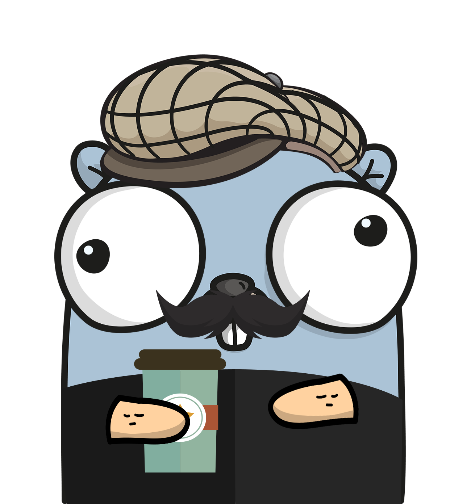

# :scroll: xWAL

<div align="center">

A Cross, thread-safe and buffered Write Ahead Log (WAL) library for Golang applications.



[](https://github.com/pantuza/xwal/actions/workflows/main.yml)
[](https://pkg.go.dev/github.com/pantuza/xwal)
[](https://goreportcard.com/report/github.com/pantuza/xwal)
[](https://opensource.org/licenses/MIT)
[](https://github.com/pantuza/xwal/releases)

</div>

* Cross? Yes, we mean you can choose your WAL Backend: Local Filesystem, AWS S3, etc.
* Thread-safe? Yes, once you have an xwal instance, you can safely call its methods concurrently.
* Buffered? Yes, xwal uses an in-memory buffer that flushes to the chosen WAL Backend asynchronously.

## When to use xwal

xwal fits when you want an **application-level WAL** with **pluggable storage** (local disk or S3-shaped object stores), **optional buffering** before persistence, and **replay** into your own code. It is not an embedded LSM like BoltDB, not etcd’s replicated WAL, and not a general audit log framework: it focuses on ordered append, recovery-style replay, checkpoints, and OpenTelemetry hooks. If you only need crash-safe local logs inside one process, a simpler file logger may suffice; if you need multi-host consensus, use a system designed for that.

## Requirements

- Go **1.26** or newer (see `go.mod`).

## Installation

```bash
go get github.com/pantuza/xwal
```

## Usage

Import the **module root** (not a nested `internal` path):

```go
import (
	"github.com/pantuza/xwal"
	"github.com/pantuza/xwal/protobuf/xwalpb"
)

func example() error {
	cfg := xwal.NewXWALConfig("") // default configuration (optional YAML: xwal.yaml)

	w, err := xwal.NewXWAL(cfg)
	if err != nil {
		return err
	}
	defer func() { _ = w.Close() }()

	if err := w.Write([]byte(`{"data": "serialized payload"}`)); err != nil {
		return err
	}

	// Replay delivers stored entries to your callback in order.
	if err := w.Replay(func(entries []*xwalpb.WALEntry) error {
		for _, entry := range entries {
			_ = entry // send to your remote system or apply locally
		}
		return nil
	}, 5, false); err != nil {
		return err
	}
	return nil
}
```

Set `cfg.WALBackend` and `cfg.BackendConfig` for LocalFS or AWS S3; see [examples](./examples/).

## Durability and errors

- **Buffer vs disk/object store:** Appends land in memory first; they reach the backend when the buffer is full, on the periodic flush ticker, or when you close the WAL (subject to backend behavior).
- **Backend write failures:** If the backend returns an error during a flush, xwal logs the error and records metrics/traces; the internal flush helper historically returns `nil` for backward compatibility, so **do not assume** that a successful return from `Write` means data is already durable until you understand this contract. Monitor `xwal.backend.errors` and logs in production. See [OBSERVABILITY.md](./OBSERVABILITY.md).
- **Shutdown:** Call `Close()` for graceful teardown (stops the flush ticker, waits for in-flight appends, closes the backend). SIGINT/SIGTERM trigger `Close` from a background handler.
- **Config file:** If loading fails, xwal falls back to defaults. A **missing** default `xwal.yaml` (when you call `NewXWALConfig("")`) is silent; other failures (explicit path missing, read/parse errors) are logged with the standard library logger.

## Available Backends

| Backend | Description   | Examples   |
|-------------- | -------------- | -------------- |
| **Local FS**    | WAL entries are stored on the local filesystem     | [localfs](./examples/localfs/)     |
| **AWS S3**    | WAL entries are stored remotely on AWS S3    | [awss3](./examples/awss3/)  |

Custom backends: [BACKENDS.md](./BACKENDS.md) and [`pkg/types/wal_backend.go`](./pkg/types/wal_backend.go).

## Features

- Pluggable backends (local disk, Amazon S3) with a shared API.
- In-memory buffering with asynchronous flush to the backend.
- Safe concurrent use of a single `XWAL` instance from multiple goroutines.
- Replay with ordered delivery to a callback for recovery or reprocessing.
- Configurable segment sizing, buffer limits, logging (zap), and backend-specific options.

## Observability

xwal emits **OpenTelemetry metrics** (counters, histograms, and async gauges for buffer state, LSN, segment index) and **traces** (spans for append, flush, backend write, replay, and checkpoint). Your service decides how to export them: for example **OTel Metrics → Prometheus** on your existing `/metrics` endpoint, and **OTLP traces** to Jaeger, Tempo, or the OpenTelemetry Collector. By default, global OTel providers are no-op until you configure them; use **`WriteContext` / `WriteBatchContext`** to attach WAL spans under incoming request traces.

**Full reference:** metric names, attributes, span names, setup steps, and a runnable stdout demo are documented in [**OBSERVABILITY.md**](./OBSERVABILITY.md).

## Benchmarks

Micro-benchmarks live in [`benchmark/`](./benchmark/): they exercise the in-memory buffer (`BenchmarkWrite`), concurrent `XWAL.Write` calls (`BenchmarkConcurrentWrites`, each run uses an isolated temp WAL directory), and a small LocalFS write plus replay loop (`BenchmarkLocalFSReplay`). Run them with `make bench` (or `go test ./benchmark/ -bench .`); the Makefile runs five iterations per benchmark with the race detector enabled, matching CI-style checks.

```
 •  Running project benchmarks..
goos: darwin
goarch: arm64
pkg: github.com/pantuza/xwal/benchmark
cpu: Apple M2 Pro
BenchmarkWrite-10                        1297502               951.0 ns/op
BenchmarkWrite-10                        1334887               887.8 ns/op
BenchmarkWrite-10                        1351389               882.6 ns/op
BenchmarkWrite-10                        1357402               870.3 ns/op
BenchmarkWrite-10                        1349440               951.7 ns/op
BenchmarkConcurrentWrites-10                4315            256560 ns/op
BenchmarkConcurrentWrites-10                4444            262845 ns/op
BenchmarkConcurrentWrites-10                4240            261856 ns/op
BenchmarkConcurrentWrites-10                4687            262923 ns/op
BenchmarkConcurrentWrites-10                4113            265323 ns/op
BenchmarkLocalFSReplay-10                    181           8716194 ns/op
BenchmarkLocalFSReplay-10                    117           9738984 ns/op
BenchmarkLocalFSReplay-10                    100          11584058 ns/op
BenchmarkLocalFSReplay-10                    110          10509325 ns/op
BenchmarkLocalFSReplay-10                    103          14094333 ns/op
✅ PASS
ok      github.com/pantuza/xwal/benchmark       30.240s
```

## Contributing

See [CONTRIBUTING.md](./CONTRIBUTING.md). Short version: fork, branch, run `make check`, open a PR, and update the changelog when behavior or the public API changes.

## Security

See [SECURITY.md](./SECURITY.md).

## License

* [MIT License](./LICENSE)

## Knowledge Base

* [Write Ahead Log](https://en.wikipedia.org/wiki/Write-ahead_logging)
* [xWAL examples](./examples)
